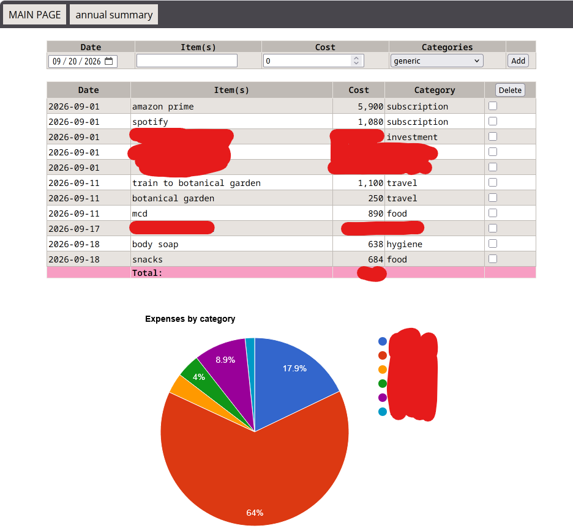

# Turbo Accounting

This is a modern port/upgrade of my old accounting app I've developed in PHP many years ago. It's used to track your monthly spending.

## Setup

1. Install [Node.js](https://nodejs.org/en).
2. Run `npm install` inside the repo directory.
3. Run `npm run start` to start the app. The URL to access the interface will be printed in the console.

## Usage

For every income and spending of the month, add them to the list using input form. You can type description of the income/spending (optional), along with amount and category of the spending. Categories are editable, but some of them are built-in and cannot be edited. Built-in categories are the following:

- other (any spending that doesn't belong to a specific category)
- income
- investment

### Environment Variables

You can either set the environment variables through console, or create a `.env` in project root to set environment variables. Example `.env` looks like this:

``` bash:.env
PORT=8008
```

Supported variables are following:

- PORT: Port number used for server. Defaults to 3000 if not set.

## Development Environment

This project is developed in:

- Windows 11
- Node.js v22.15.0

## Credits

This project uses icons from [Bootstrap Icons](https://icons.getbootstrap.com/).
The UI was made with [Tailwind CSS](https://tailwindcss.com/) and [daisyUI](https://daisyui.com/).
Charts were made with [Chart.js](https://github.com/chartjs/Chart.js).

All licensed under MIT license.

## Extra



This is what my old app looked like. Some parts are censored, because it's my real spending data for that month :p

It was made in PHP, and I've used it from 2022 to 2026 with little change to the app. Functional, but desperately needed an upgrade.
